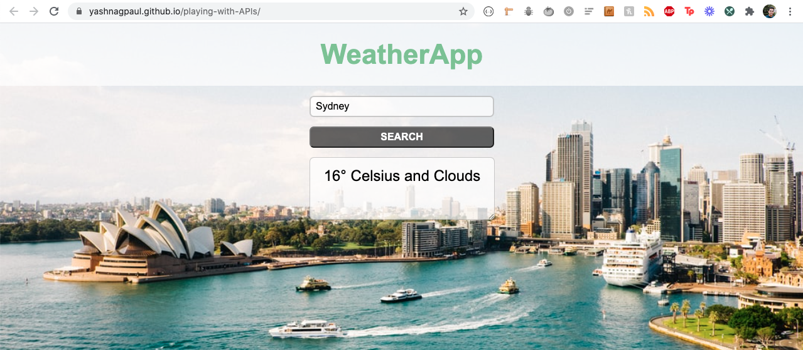

# Check the weather of any city <a href='https://yashnagpaul.github.io/playing-with-APIs/'>here</a>
This web-applet lets the user search for the current weather of a city by entering the city's name in a textfield.
The app uses openWeather API to fetch the weather data.
It also uses API from unsplash.com to set the background image as an image from that city.
</img>
